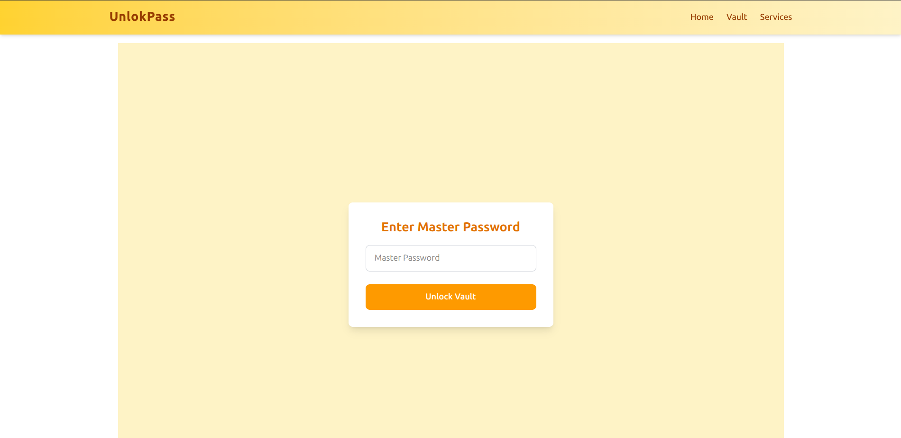

# 🔐 Password Manager



A secure and modern **Password Manager** built using **React 19**, **Redux Toolkit**, **Tailwind CSS**, and **Vite**. Store, manage, and encrypt your credentials safely with a clean and responsive UI.

---

## 🚀 Features

- 🔐 **Encrypted Storage** with `crypto-js`
- 🌐 **Routing** with `react-router`
- 🌈 **Modern UI** with Tailwind CSS and Lucide Icons
- 🧠 **State Management** using Redux Toolkit
- ⚡ **Fast Development** with Vite
- ☕ **Toast Notifications** with `react-hot-toast`
- 🆔 Unique ID generation with `uuid`

---

## 🛠️ Tech Stack

| Tech                 | Description                 |
| -------------------- | --------------------------- |
| React 19             | Frontend library            |
| Redux Toolkit        | State management            |
| Tailwind CSS         | Utility-first CSS framework |
| Vite                 | Development/build tool      |
| Axios                | HTTP requests               |
| React Router         | Client-side routing         |
| Crypto-JS            | Encryption/decryption       |
| React Hot Toast      | Toast notifications         |
| React Icons / Lucide | Icon library                |

---

## 📦 Project Setup

### Clone the repo

```bash
git clone https://github.com/your-username/passwordmanager.git
cd passwordmanager
```

---

> ⚠️ This project is still under development.  
> New features, improvements, and security enhancements are actively being worked on.

Thank you for checking out **UnlokPass – Password Manager**!  
If you found this project helpful or interesting, feel free to ⭐ star the repo and share your feedback.
